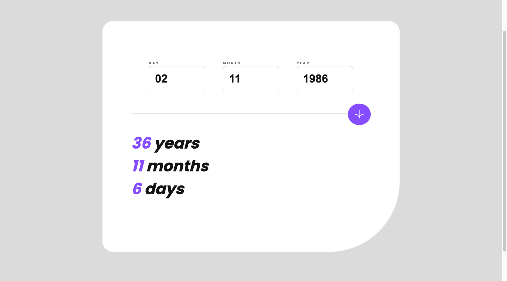
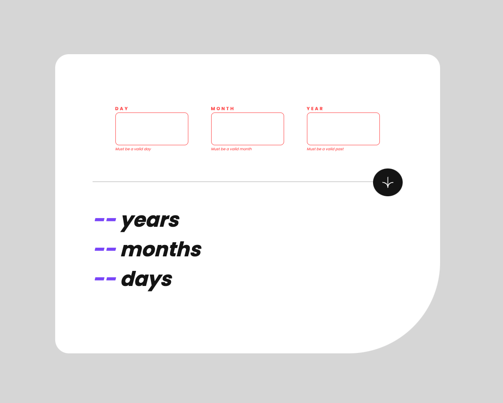
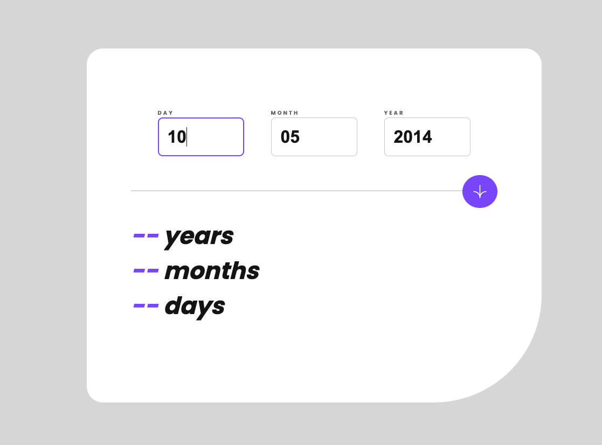

# Frontend Mentor - Age calculator app

## Welcome! 👋

Thanks for checking out this front-end coding challenge.

[Frontend Mentor](https://www.frontendmentor.io) challenges help you improve your coding skills by building realistic projects.

**To do this challenge, you need a decent understanding of HTML, CSS and JavaScript.**

## The challenge

Your challenge is to build out this age calculator app and get it looking as close to the design as possible.

You can use any tools you like to help you complete the challenge. So if you've got something you'd like to practice, feel free to give it a go.

Your users should be able to: 

- View an age in years, months, and days after submitting a valid date through the form
- Receive validation errors if:
  - Any field is empty when the form is submitted
  - The day number is not between 1-31
  - The month number is not between 1-12
  - The date is in the future
  - The date is invalid e.g. 31/04/1991 (there are 30 days in April)
- View the optimal layout for the interface depending on their device's screen size
- See hover and focus states for all interactive elements on the page
- **Bonus**: See the age numbers animate to their final number when the form is submitted

Want some support on the challenge? [Join our Slack community](https://www.frontendmentor.io/slack) and ask questions in the **#help** channel.

# Table of contents

- [Overview](#overview)
  - [Screenshot](#screenshot)
  - [Links](#links)
- [My process](#my-process)
  - [Built with](#built-with)
  - [What I learned](#what-i-learned)
- [Author](#author)

**Note: Delete this note and update the table of contents based on what sections you keep.**

## Overview

A return taken by me on the Mentor frontend website, which consists of creating several views depending on the device, the project refers to a form that validates the input, depending on the case it will show an alert.

### Screenshot

### Links

- Solution URL: [Add solution URL here](https://cyeguez.github.io/age-calculator-app-main/)
- Live Site URL: [Add live site URL here](https://github.com/cyeguez/age-calculator-app-main)

## My process

### Built with

- Semantic HTML5 markup
- CSS custom properties
- Flexbox
- CSS Grid
- SASS
- Mobile-first workflow

**Note: These are just examples. Delete this note and replace the list above with your own choices**

### What I learned

I learned the use of regular expressions, to handle the events and attributes of elements in java scripts a little better

**Note: Delete this note and the content within this section and replace with your own learnings.**

## Author

- Website - [César Yeguez](https://www.your-site.com)
- Frontend Mentor - [https://github.com/cyeguez](https://www.frontendmentor.io/profile/yourusername)
